# Backplane

[](https://github.com/kar1hsu/backplane/actions/workflows/ci.yml)

English | [简体中文](README.md)

Backplane is a modular Go admin framework designed as a practical foundation for real business applications. The backend uses Gin, GORM, Casbin, and JWT. The Vue 3 admin panel is bundled into the same binary with Go `embed`.

It provides the infrastructure most admin projects repeatedly rebuild: users and roles, button-level RBAC, automatic policy synchronization, runtime settings, operation auditing, task queues, file uploads, and Docker deployment. Keep the foundation and focus on your business modules.

> Two admin interfaces are available: `master` uses Element Plus, while the [`naive-ui`](https://github.com/kar1hsu/backplane/tree/naive-ui) branch uses Naive UI.

## Screenshots

### master · Element Plus

| Login | Dashboard |
| --- | --- |
| 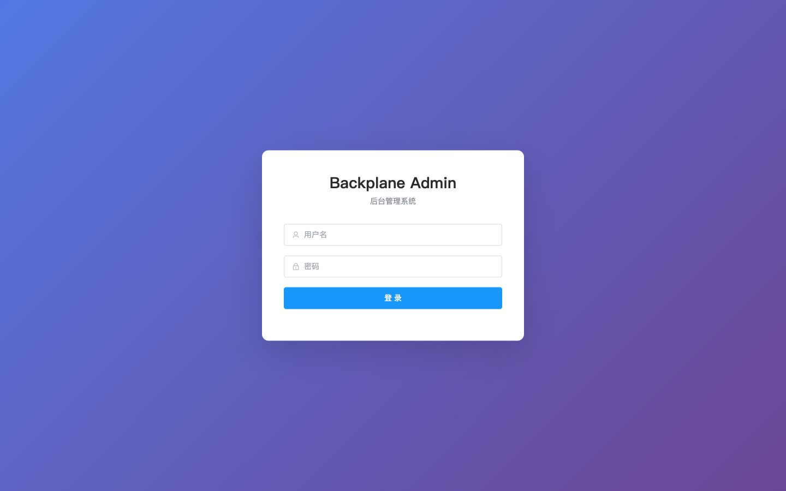 | 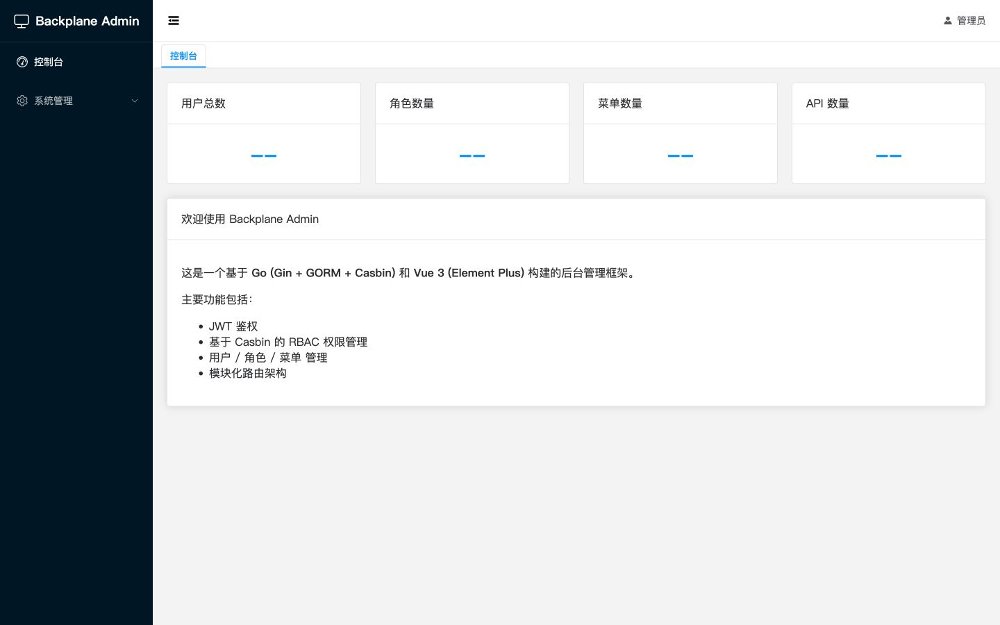 |

<details>
<summary>View the Element Plus core pages</summary>

| Users | Roles |
| --- | --- |
| 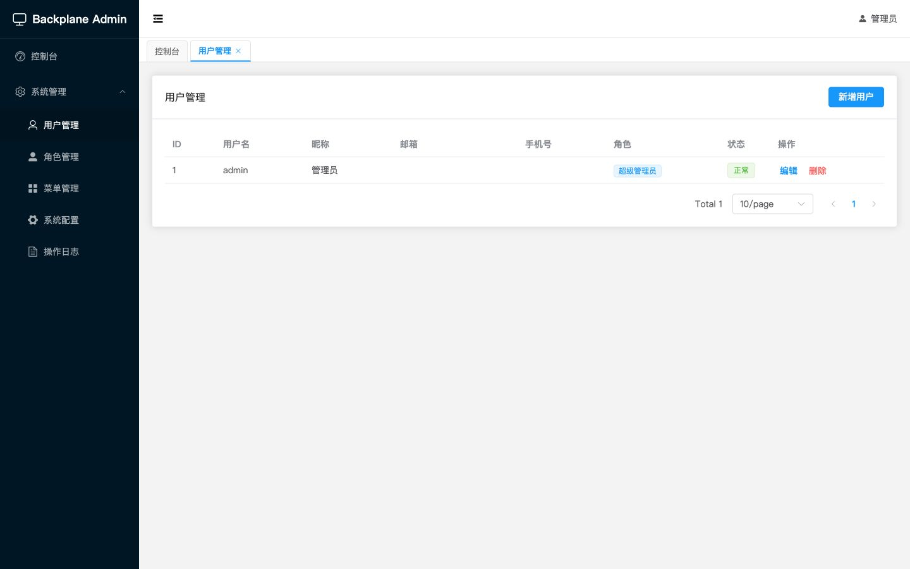 | 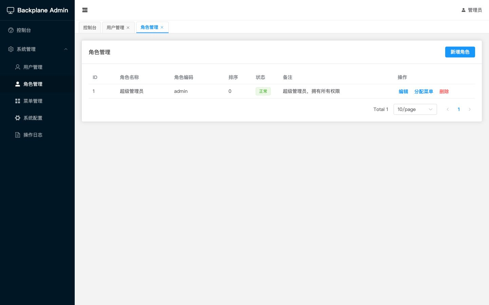 |

| Menus and button permissions | Runtime settings |
| --- | --- |
| 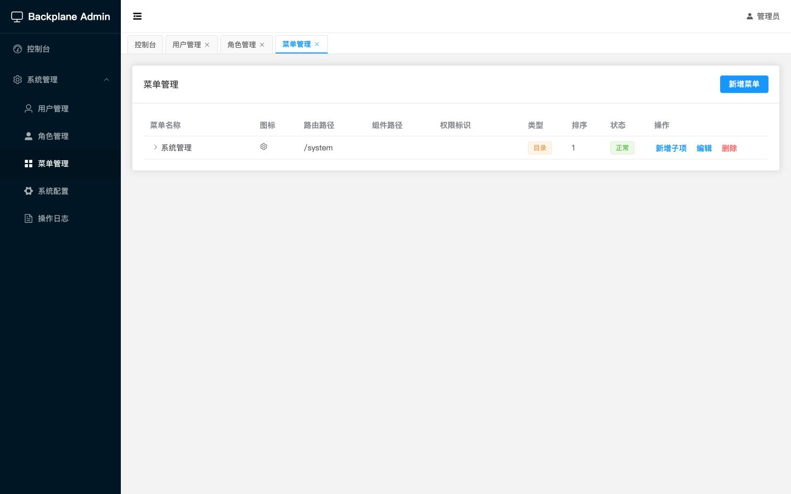 | 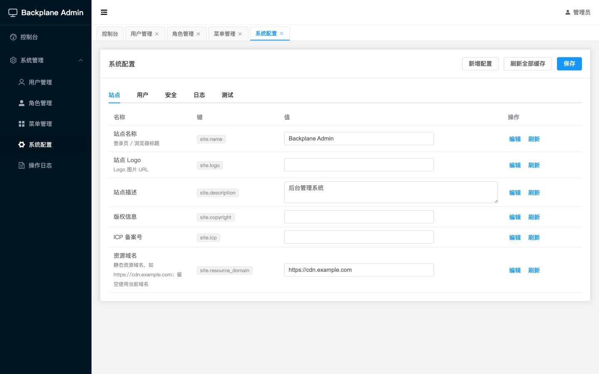 |

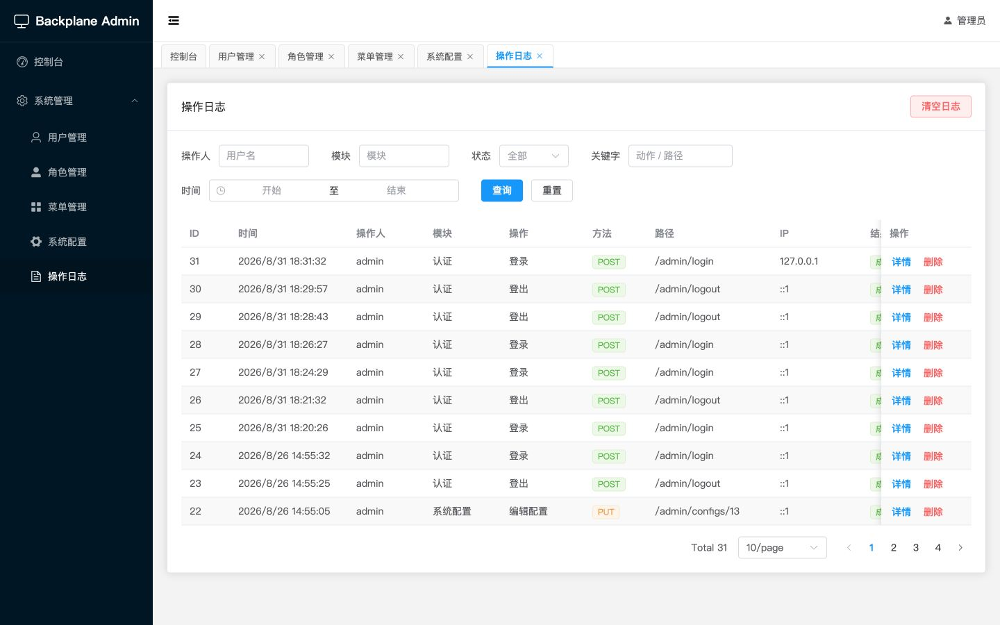

</details>

### naive-ui · Naive UI

The Naive UI redesign lives on the [`naive-ui`](https://github.com/kar1hsu/backplane/tree/naive-ui) branch:

```bash
git switch naive-ui
```

| Login | Dashboard |
| --- | --- |
| 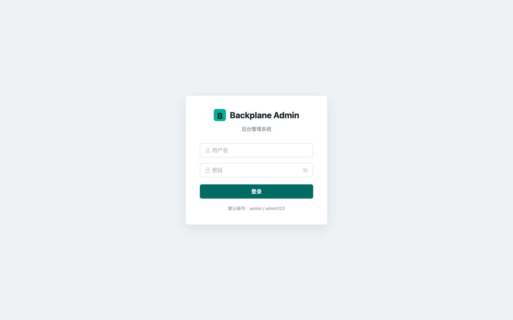 | 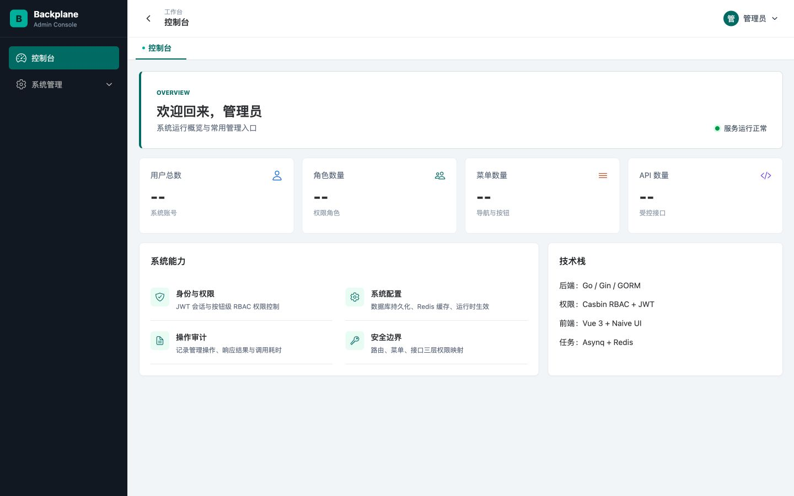 |

<details>
<summary>View the Naive UI core pages</summary>

| Users | Roles |
| --- | --- |
| 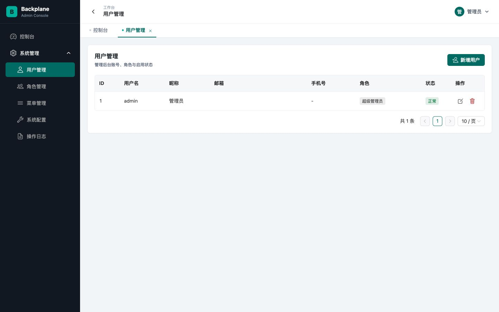 | 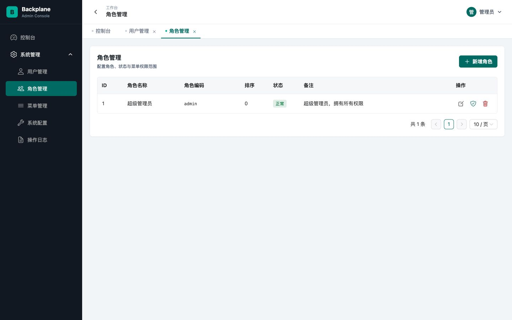 |

| Menus and button permissions | Runtime settings |
| --- | --- |
| 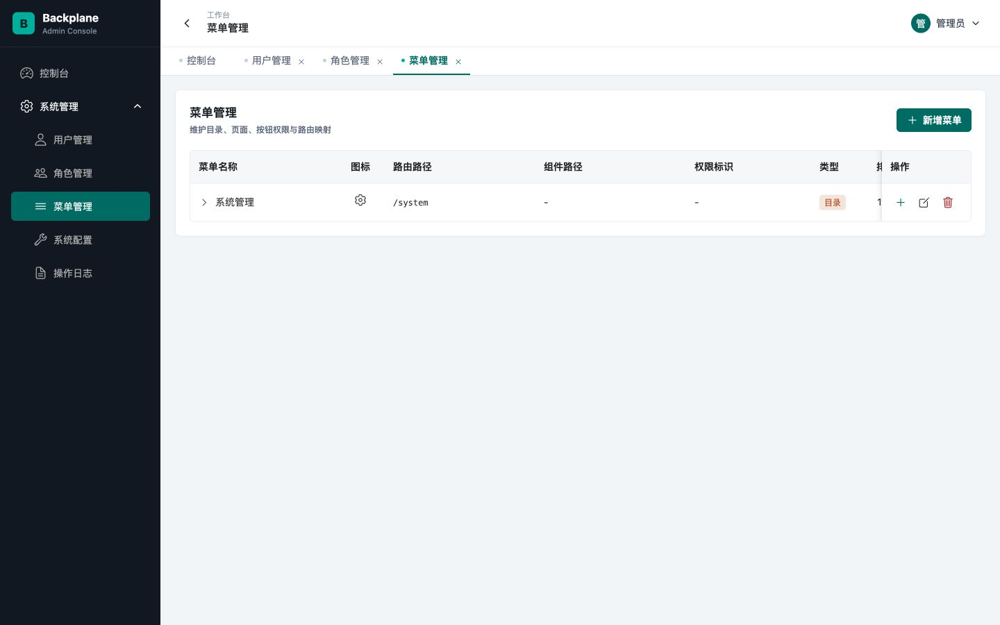 | 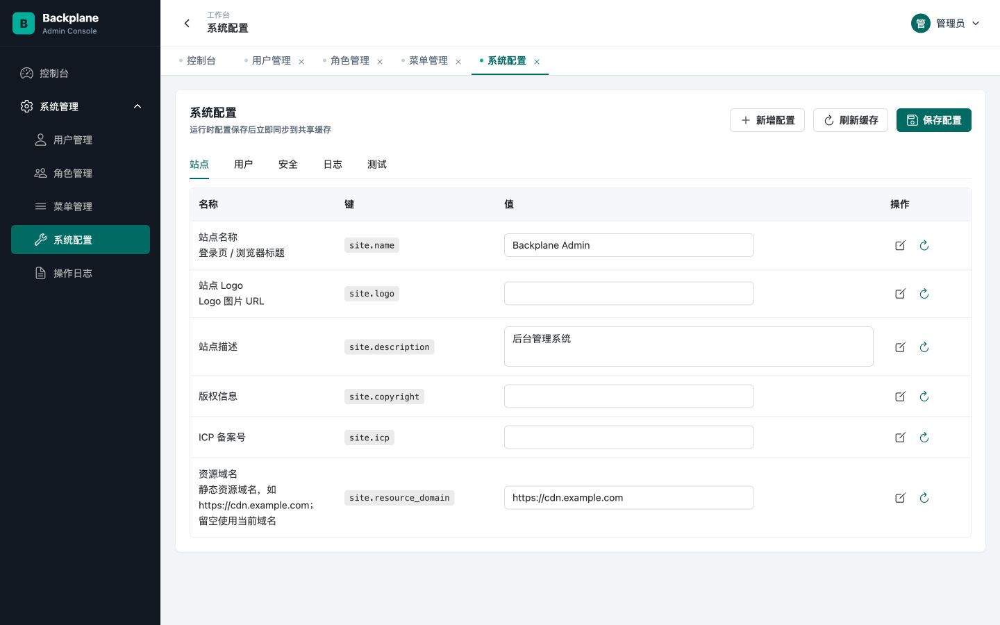 |

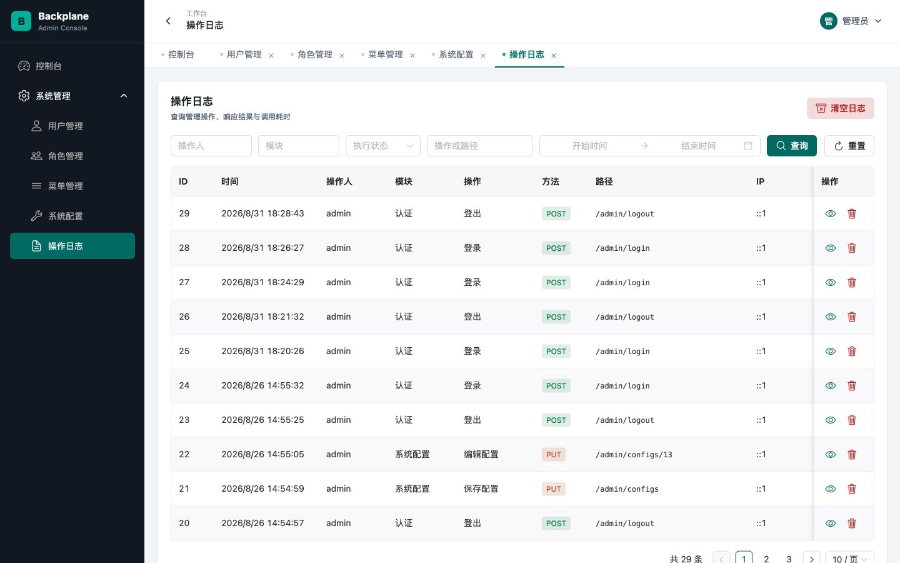

</details>

## Core Features

- **Authentication and security:** JWT sessions, token blacklist, bcrypt password hashing, and login throttling.
- **RBAC:** Casbin route authorization with directory, menu, and button permissions plus path-parameter matching.
- **Automatic policy sync:** assigning menus to a role maintains the matching Casbin policies from linked APIs.
- **System management:** users, roles, menus, APIs, and runtime settings in one admin panel.
- **Operation auditing:** operator, module, request, response, result, source IP, and latency with search and cleanup.
- **Settings and cache:** database-backed settings with Redis caching for immediate multi-instance updates.
- **Task system:** immediate, delayed, unique, and cron tasks powered by Asynq.
- **File uploads:** local storage, date folders, randomized filenames, size limits, and MIME validation.
- **Delivery and deployment:** embedded frontend, MySQL / PostgreSQL support, and Docker Compose.

## Tech Stack

| Backend | Frontend | Infrastructure |
| --- | --- | --- |
| Go · Gin · GORM · Casbin · JWT | Vue 3 · Element Plus · Vite · Pinia | MySQL / PostgreSQL · Redis · Asynq · Docker |

## Run in 3 Minutes

### Docker Compose

Install Git and Docker first:

```bash
git clone git@github.com:kar1hsu/backplane.git
cd backplane/deploy

cp .env.example .env
cp ../config/config.yaml.example config.yaml
docker compose up -d --build
```

Open [http://localhost:8080](http://localhost:8080) after startup.

The default administrator account is `admin` / `admin123`. The first startup creates the schema and base permission data automatically. Change the default password, database passwords, and `jwt.secret` before production deployment.

### Local Development

Requirements: Go 1.21+, Node.js 20+, MySQL 8+ or PostgreSQL 14+, and Redis 6+.

```bash
git clone git@github.com:kar1hsu/backplane.git
cd backplane

cp config/config.yaml.example config/config.yaml
# Update the database, Redis, and JWT settings in config/config.yaml

cd web/admin
npm ci
npm run build
cd ../..

go run ./cmd/server
```

For frontend development, run `npm run dev` in `web/admin` and open [http://localhost:5173](http://localhost:5173).

Start the task worker and scheduler as separate processes when needed:

```bash
go run ./cmd/worker
go run ./cmd/scheduler
```

## Build Your Business Module

Backplane registers routes by module. Use `internal/module/api` as the starting point for a business module, keeping Handler, Service, and Repository responsibilities separate.

A module only needs to implement `server.Module`:

```go
type Module interface {
	Name() string
	RegisterRoutes(rg *gin.RouterGroup)
}
```

Register it in `cmd/server/main.go`:

```go
router := server.NewRouter(
	backplane.AdminDist,
	admin.New(),
	api.New(),
	yourmodule.New(),
)
```

Recommended workflow:

1. Add routes, handlers, and services under `internal/module/<name>`.
2. Add models and data access under `internal/model` and `internal/repository`.
3. Include new models in migration and add seed data where needed.
4. Add the admin page, route, menu, and permission identifiers.
5. Link APIs to menus so role assignment can synchronize Casbin policies automatically.

## Project Layout

```text
backplane/
├── cmd/                    # server, worker, and scheduler entry points
├── config/                 # config example and Casbin model
├── internal/
│   ├── app/                # database, Redis, Casbin, and task initialization
│   ├── middleware/         # JWT, RBAC, logging, auditing, and CORS
│   ├── model/              # data models
│   ├── module/             # admin, api, and business modules
│   ├── pkg/                # cache, setting, task, storage, and shared packages
│   ├── repository/         # data access
│   └── server/             # module registration and static file serving
├── web/admin/              # Vue 3 admin panel
├── deploy/                 # Dockerfile and Docker Compose
└── embed.go                # embedded admin build output
```

## Quality Checks

GitHub Actions runs:

```bash
go test ./...
go vet ./...
golangci-lint run
npm run build --prefix web/admin
```

## Acknowledgements

Thanks to [Gin](https://gin-gonic.com/), [GORM](https://gorm.io/), [Casbin](https://casbin.org/), [Vue](https://vuejs.org/), [Element Plus](https://element-plus.org/), [Naive UI](https://www.naiveui.com/), and the wider open-source community. The `naive-ui` redesign is built on Naive UI.

If Backplane helps you, please consider giving the [GitHub repository](https://github.com/kar1hsu/backplane) a Star. Issues and pull requests are welcome.
